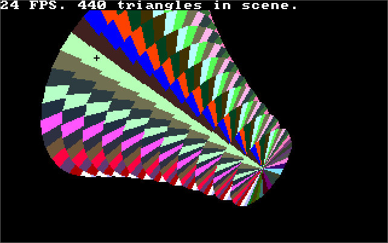

# 3D Engine (DOS)

### About:
A 3D Engine demonstration.

### Instructions:
Move the mouse to change the direction of the object, use left and right mouse buttons to rotate it.

**DOSBox config:** Set CPU Core to "dynamic" and CPU Cycles to "max" (or run "core=dynamic" and "cycles=max" in the command prompt before running "slime.exe"), press CTRL+F10 for mouse movement to work (and again to release it to close DOSBox)

### Screenshot:

### Info:
**Created:** 2002

**Operating System:** Dos 6

**Compile with:** Borland Turbo C++ 3.x (make sure your "Options" -> "Directories" paths for "Libraries" and "Includes" are correct)
